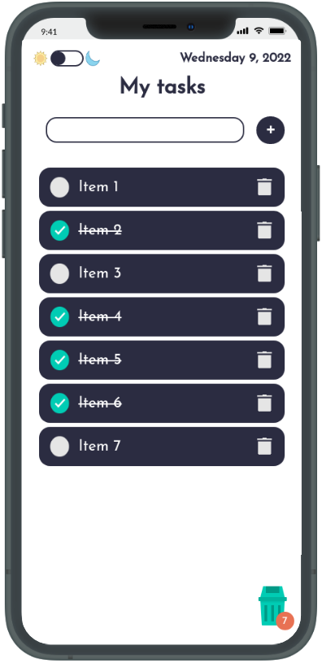
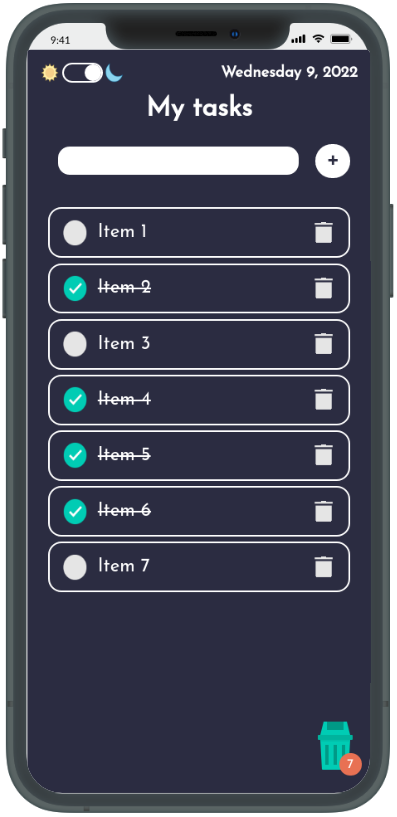

# Simple To Do

<p align="center">
  
  
  
  <a href="https://opensource.org/licenses/MIT">
    
  </a>
</p>

This is a second version of my <a href="https://github.com/diegosouza007/kanban-tasks">other project</a> that was build using only Vanilla JS.

In this project and in another new future I'll build using ReactJS.

# Install

Run the following commands os seguintes comandos em um terminal:

```
git clone https://github.com/diegosouza007/simple-to-do.git
```

```
cd simple-to-do
```

# To run the project

Use this command to run: 

```
npm start
```

## Preview




Preview link: <a href="https://simple-to-do-five.vercel.app/">https://simple-to-do-five.vercel.app/</a>

